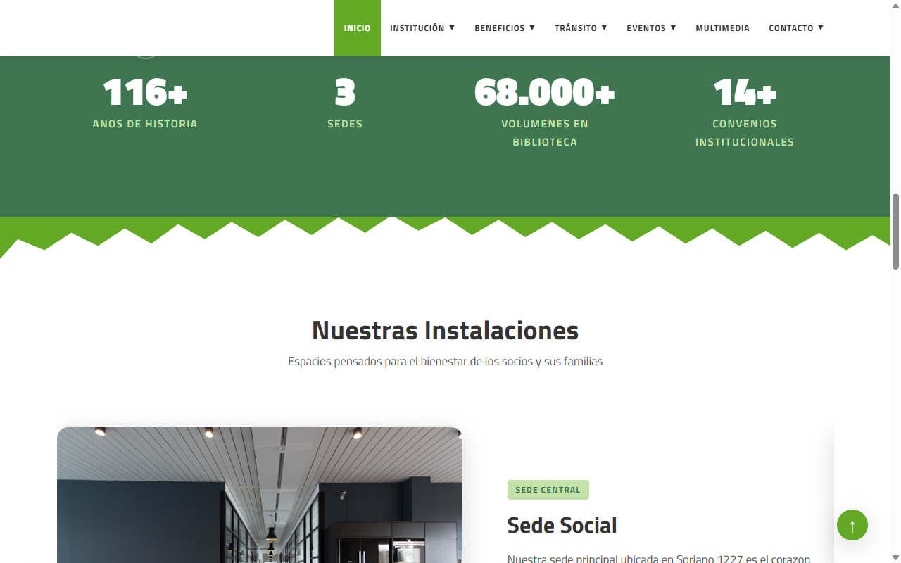
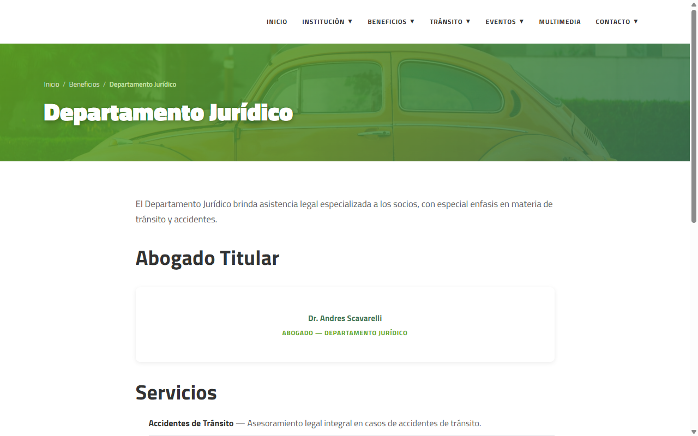
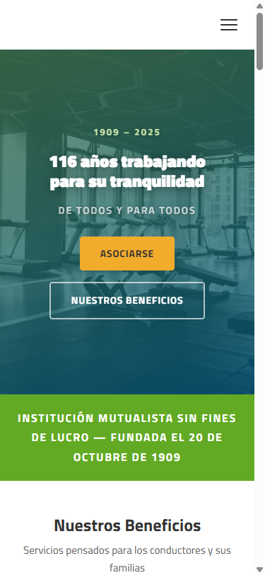
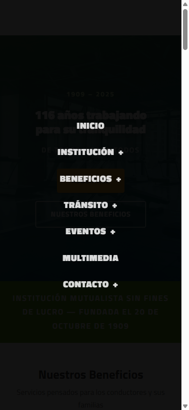

# Centro Protección Choferes de Montevideo — Sitio Web

Sitio web institucional del Centro Protección Choferes de Montevideo (CPCH). Sitio estático de 41 páginas HTML con CSS y JavaScript vanilla, sin frameworks ni herramientas de compilación.

---

## Vista previa

### Escritorio

| Hero | Beneficios | Estadísticas e Instalaciones |
|------|-----------|------------------------------|
|  |  |  |

### Página interior



### Móvil

| Inicio | Menú de navegación |
|--------|--------------------|
|  |  |

---

## Desarrollo local

Para previsualizar el sitio en tu computadora necesitás tener [Node.js](https://nodejs.org) instalado.

```bash
npx serve . -p 3456
```

Luego abrí el navegador en `http://localhost:3456`.

---

## Cómo publicar el sitio

### Opción 1 — GitHub Pages (recomendado, gratis)

Es la forma más sencilla ya que el código ya está en GitHub.

1. Ir al repositorio en GitHub: `https://github.com/MBarrett0/ProteccionChoferes`
2. Hacer clic en **Settings** (Configuración)
3. En el menú izquierdo, hacer clic en **Pages**
4. En la sección **Branch**, seleccionar `main` y la carpeta `/ (root)`
5. Hacer clic en **Save**
6. Esperar 1-2 minutos. El sitio quedará disponible en:
   `https://mbarrett0.github.io/ProteccionChoferes/`

Cada vez que se suba un cambio al repositorio, el sitio se actualiza automáticamente.

---

### Opción 2 — Netlify (gratis, dominio personalizado más fácil)

1. Crear una cuenta en [netlify.com](https://www.netlify.com)
2. Hacer clic en **Add new site** → **Import an existing project**
3. Conectar con GitHub y seleccionar el repositorio `ProteccionChoferes`
4. Dejar todas las opciones por defecto (no hay comandos de build)
5. Hacer clic en **Deploy site**
6. El sitio queda disponible en una URL del tipo `https://nombre-aleatorio.netlify.app`

Para conectar un dominio propio (ej. `proteccionchoferes.org.uy`), ir a **Domain settings** dentro del proyecto en Netlify y seguir las instrucciones.

---

### Opción 3 — Vercel (gratis)

1. Crear una cuenta en [vercel.com](https://vercel.com)
2. Hacer clic en **Add New Project**
3. Importar el repositorio `ProteccionChoferes` desde GitHub
4. Dejar todas las opciones por defecto
5. Hacer clic en **Deploy**
6. El sitio queda disponible en una URL del tipo `https://proteccion-choferes.vercel.app`

---

## Subir cambios al sitio

Cada vez que se modifique un archivo localmente, hay que subir los cambios a GitHub para que el sitio se actualice:

```bash
git add -A
git commit -m "Descripción del cambio"
git push
```

Con GitHub Pages y Netlify/Vercel conectados al repositorio, el sitio se republica automáticamente en 1-2 minutos.

---

## Estructura del proyecto

```
index.html          # Página de inicio
[pagina].html       # Cada página es un archivo HTML independiente
css/styles.css      # Hoja de estilos única para todo el sitio
js/main.js          # JavaScript para la interactividad
images/             # Logo e imágenes (logo.png debe ser provisto por el cliente)
contenido-sitio-web.md  # Fuente de contenido extraída del sitio original
```

---

## Pendiente

- **`images/logo.png`** — El logo oficial de CPCH debe colocarse en esta carpeta. Mientras tanto el espacio del logo queda vacío.
- **Formularios** — Los formularios de contacto y asociarse no tienen backend. Para activarlos se puede usar [Formspree](https://formspree.io) o [Netlify Forms](https://www.netlify.com/products/forms/) sin necesidad de programar.
- **Dominio propio** — Para usar `proteccionchoferes.org.uy` hay que configurar los DNS del dominio apuntando al hosting elegido (GitHub Pages, Netlify o Vercel).
